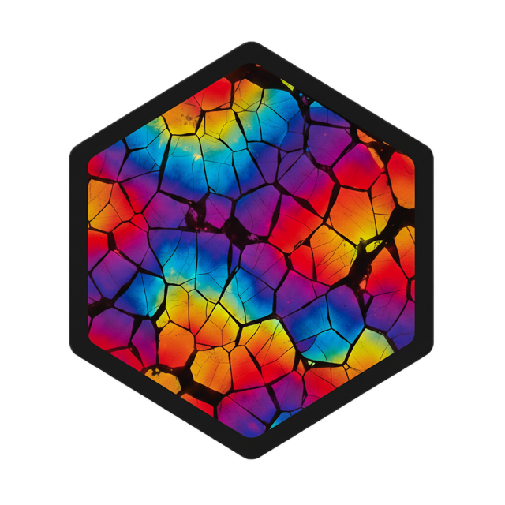

# petrographer 

<!-- badges: start -->
[](https://lifecycle.r-lib.org/articles/stages.html#experimental)
[](https://github.com/flmnh-ai/petrographer/actions/workflows/R-CMD-check.yaml)
<!-- badges: end -->

> HuggingFace-like interface for petrographic thin section analysis with Detectron2 and SAHI

Automated instance segmentation and morphological analysis of petrographic thin sections using state-of-the-art computer vision models. Provides a clean, modern workflow for both researchers running inference with pretrained models and developers training custom models.

## Quick Start (Users)

For running inference with pretrained models:

```r
library(petrographer)

# Load model from public hub
model <- from_pretrained("inclusions")

# Run prediction on an image
results <- predict(model, "my_image.jpg")

# Analyze results
summarize_by_image(results)
get_population_stats(results)
```

## Quick Start (Developers)

For training custom models:

```r
library(petrographer)

# Validate dataset structure
validate_dataset("data/processed/my_dataset")

# Train model (automatically saves to .petrographer/)
train_model(
  data_dir = "data/processed/my_dataset",
  output_name = "my_model",
  num_classes = 5
)

# Load your trained model
model <- load_model("my_model")
results <- predict(model, "test_image.jpg")
```

## Table of Contents

- [Installation](#installation)
- [Model Hub](#model-hub)
- [Training Models](#training-models)
- [Running Predictions](#running-predictions)
- [Core Functions](#core-functions)
- [Dataset Management](#dataset-management)
- [HPC Training](#hpc-training-slurm)
- [Documentation](#documentation)
- [Configuration](#configuration)
- [Troubleshooting](#troubleshooting)
- [Citation](#citation)

## Installation

```r
# Install from GitHub
remotes::install_github("flmnh-ai/petrographer")
```

### Prerequisites

- **R 4.1+**
- **Python 3.8+** with detectron2, sahi, torch, torchvision, opencv-python, scikit-image
- **GPU recommended** for training (CPU works fine for inference)

Python dependencies are managed automatically via `reticulate`. The package will guide you through setup on first use.

## Model Hub

Models are managed via the [pins](https://pins.rstudio.com/) package with automatic versioning and caching:

### Public Hub

Hosted at:
- Models: https://flmnh-ai.s3.us-east-1.amazonaws.com/.petrographer/models/
- Datasets: https://flmnh-ai.s3.us-east-1.amazonaws.com/.petrographer/datasets/

```r
# Download and load pretrained model
model <- from_pretrained("shell_v3", device = "cpu", confidence = 0.5)

# Browse available models
list_models()

# Get model details
model_info("shell_v3")
```

### Local Training Board

Automatically created at `.petrographer/` in your project when training models:

```r
# List your locally trained models
list_trained_models()

# Load a local model (convenience wrapper)
model <- load_model("my_model")

# Or explicitly specify local board
model <- from_pretrained("my_model", board = "local")
```

### Custom Boards

Advanced users can specify their own boards:

```r
my_board <- pins::board_folder("~/shared-models", versioned = TRUE)
model <- from_pretrained("model_id", board = my_board)
```

## Training Models

### Local Training

```r
train_model(
  data_dir = "data/processed/shell_dataset",
  output_name = "shell_detector_v4",
  num_classes = 5,
  max_iter = 2000,      # default for fine-tuning
  freeze_at = 2,        # freeze stem + res2 (default)
  backbone = "resnet50", # resnet50, resnet101, resnext101
  device = "cuda"        # or "cpu", "mps"
)
```

### Training Configuration

Default parameters optimized for fine-tuning:

- `max_iter = 2000` - Training iterations
- `ims_per_batch = NA` - Auto-resolves to 2 images per GPU
- `freeze_at = 2` - Freeze backbone stem + res2 layers
- `learning_rate = 0.00025` - Base LR (auto-scaled by batch size and freeze_at)
- `backbone = "resnet50"` - Options: resnet50, resnet101, resnext101, or any Detectron2 model zoo key

The package automatically:
- Validates dataset structure
- Computes optimal batch sizes and learning rates
- Handles version conflicts
- Saves model to `.petrographer/models/` with full metadata
- Creates training manifests with validation metrics

### Dataset Preparation

Organize data in COCO format:

```
data/processed/my_dataset/
├── train/
│   ├── _annotations.coco.json
│   └── [training images]
└── val/
    ├── _annotations.coco.json
    └── [validation images]
```

Validate before training:

```r
validate_dataset("data/processed/my_dataset")
```

For images with highly variable sizes, use SAHI slicing:

```r
slice_dataset(
  input_dir = "data/raw/my_dataset",
  output_dir = "data/processed/my_dataset_sliced",
  slice_size = 512,
  overlap = 0.2
)
```

## Running Predictions

### Single Image

```r
# Simple prediction (saves visualization by default)
results <- predict(model, "image.jpg")

# With custom SAHI parameters
results <- predict_image(
  image_path = "image.jpg",
  model = model,
  use_slicing = TRUE,
  slice_size = 512,
  overlap = 0.2,
  save_visualizations = TRUE
)
```

### Batch Processing

```r
results <- predict_images(
  input_dir = "images/",
  model = model,
  output_dir = "results/"
)
```

### Model Evaluation

```r
# Evaluate training metrics
evaluate_training("Detectron2_Models/my_model")

# Evaluate on COCO dataset
metrics <- evaluate_model_sahi(
  model = model,
  data_dir = "data/processed/test_dataset"
)
```

### Analysis

Each detected object includes comprehensive morphological properties:

- **Basic metrics**: Area, perimeter, centroid coordinates
- **Shape descriptors**: Eccentricity, orientation, circularity, aspect ratio
- **Advanced features**: Solidity, extent, major/minor axis lengths

```r
# Per-image summary statistics
image_stats <- summarize_by_image(results)

# Population-level statistics
pop_stats <- get_population_stats(results)
```

## Core Functions

### Model Management

- `from_pretrained()` - Load model from hub, local board, or custom board
- `load_model()` - Convenience wrapper for locally trained models
- `list_models()` / `list_trained_models()` - List available models
- `model_info()` - Show model metadata and validation metrics
- `pin_model()` - Publish model to board (maintainers only)

### Dataset Management

- `validate_dataset()` - Check COCO format and show diagnostics
- `slice_dataset()` - SAHI dataset slicing for mixed image sizes
- `pin_dataset()` / `list_datasets()` - Dataset versioning and distribution

### Training

- `train_model()` - Unified training interface (local or HPC)
- `evaluate_training()` - Parse and visualize training metrics
- `prepare_training_config()` - Validate training parameters

### Prediction

- `predict()` - S3 method for PetrographyModel objects
- `predict_image()` - Single image inference with SAHI + morphology
- `predict_images()` - Batch processing with parallel support
- `evaluate_model_sahi()` - COCO evaluation metrics

### Analysis

- `summarize_by_image()` - Per-image statistics
- `get_population_stats()` - Population-level metrics

## HPC Training (SLURM)

For training on HPC clusters with SLURM (e.g., UF HiPerGator):

### One-Time Setup

Configure HPC defaults in `.Renviron`:

```r
usethis::edit_r_environ("project")
```

Add these lines:

```
PETROGRAPHER_HPC_HOST="hpg"
PETROGRAPHER_HPC_BASE_DIR="/blue/yourlab/youruser"
```

Restart R for changes to take effect.

### HPC Training

```r
# Triggers HPC mode automatically when hpc_user is provided
model_dir <- train_model(
  data_dir = "data/processed/my_dataset",
  output_name = "my_model",
  num_classes = 5,
  hpc_user = "youruser"
)
```

The package automatically:
- Uploads dataset and training script via rsync
- Submits SLURM job with optimal GPU resources
- Monitors job status with progress updates
- Downloads trained model when complete
- Cleans up remote files (data preserved by default)

### HPC Job Control

```r
# Monitor job status
hpg_status(job)

# Wait for completion with progress
hpg_wait(job)

# Cancel running job
hpg_cancel(job)

# Get job details
hpg_job_info(job)
```

## Documentation

- **Website**: https://flmnh-ai.github.io/petrographer/
- **Vignettes**:
  - [Model Library](https://flmnh-ai.github.io/petrographer/articles/model-library.html) - Browse and compare trained models
  - [Training Models](https://flmnh-ai.github.io/petrographer/articles/training-models.html) - Complete training guide
  - [Whole Slide Basics](https://flmnh-ai.github.io/petrographer/articles/whole-slide-basics.html) - Working with large images
- **Example Notebooks**: See `inst/notebooks/` for complete workflows:
  - `model_from_pretrained.qmd` - Loading and using pretrained models
  - `petrography_analysis.qmd` - End-to-end analysis workflow
  - `training_*.qmd` - Training examples for different use cases

## Configuration

### SAHI Parameters

Optimize for your data:

```r
model <- from_pretrained(
  "shell_v3",
  confidence = 0.5,    # Detection threshold (0.3-0.7 typical)
  device = "cuda"      # "cpu", "cuda", or "mps"
)

results <- predict_image(
  image_path = "image.jpg",
  model = model,
  slice_size = 512,    # Slice dimensions (512 recommended)
  overlap = 0.2        # Overlap between slices (0.2 typical)
)
```

### Environment Variables

Optional configuration:

- `PETROGRAPHER_HUB_URL` - Custom model hub URL
- `PETROGRAPHER_BOARD_PATH` - Custom local board location
- `PETROGRAPHER_HPC_HOST` - Default HPC hostname
- `PETROGRAPHER_HPC_BASE_DIR` - Default HPC working directory

## Troubleshooting

### Training Issues

- **CUDA out of memory**: Reduce `ims_per_batch` (try 1-2) or use smaller images
- **Slow training**: Check GPU utilization, consider different backbone
- **Poor convergence**: Increase `max_iter` or adjust `learning_rate`

### Detection Issues

- **Missing small objects**: Lower confidence threshold, use smaller slice sizes
- **False positives**: Increase confidence threshold, check training data quality
- **Poor segmentation**: Verify annotation quality, increase training iterations

### R-Python Integration

- **Import errors**: Check Python environment with `reticulate::py_config()`
- **Environment issues**: Restart R session, reinstall Python packages
- **Path problems**: Use absolute paths with `fs::path_abs()`

### HPC Issues

- **Connection timeout**: Check SSH config, verify Duo authentication
- **Job failures**: Check SLURM logs with `hpg_job_info(job)`
- **Transfer errors**: Verify paths and permissions on remote system

## File Structure

```
petrographer/
├── R/                            # Package functions
│   ├── pins.R                    # Model/dataset distribution via pins
│   ├── model.R                   # Model loading utilities
│   ├── training.R                # Training orchestration (local + HPC)
│   ├── prediction.R              # Inference + evaluation
│   ├── dataset.R                 # Dataset utilities
│   ├── morphology.R              # Property extraction via scikit-image
│   └── summary.R                 # Analysis and aggregation
├── inst/
│   ├── python/
│   │   ├── train.py              # Detectron2 training script
│   │   └── slice_dataset.py      # SAHI dataset slicing utility
│   └── notebooks/                # Example workflows
├── vignettes/                    # Package documentation
│   ├── model-library.qmd         # Browse trained models
│   ├── training-models.qmd       # Training guide
│   └── whole-slide-basics.qmd    # Large image workflows
├── tests/                        # Unit tests
└── .petrographer/                # Local training board (auto-created)
    ├── models/                   # Trained models with versions
    └── datasets/                 # Pinned datasets
```

## Performance Optimization

### For Dense Small Objects (200+ per image)

- Keep `ROI_HEADS.BATCH_SIZE_PER_IMAGE = 512` (default)
- Use SAHI slicing with `slice_size = 512` and `overlap = 0.2`
- Consider `TEST.DETECTIONS_PER_IMAGE = 1000` for very dense images

### Training Speed

- Use `ims_per_batch = 2` per GPU for good speed/accuracy balance
- ResNet-50 backbone is fastest, ResNeXt-101 for maximum accuracy
- Multi-GPU training automatically scales batch size and learning rate

## Contributing

This is research software under active development. Breaking changes may occur between versions. See `CLAUDE.md` for development guidelines and philosophy.

## Citation

If you use this package in your research, please cite:

```bibtex
@software{petrographer,
  title = {petrographer: Petrographic Thin Section Analysis with Deep Learning},
  author = {Nicolas Gauthier and Ashley Rutkoski},
  year = {2025},
  url = {https://github.com/flmnh-ai/petrographer},
  note = {R package version 0.0.0.9000}
}
```

## Acknowledgments

- [Detectron2](https://github.com/facebookresearch/detectron2) - Facebook AI Research's detection framework
- [SAHI](https://github.com/obss/sahi) - Slicing aided hyper inference for small object detection
- [reticulate](https://rstudio.github.io/reticulate/) - R-Python integration
- [pins](https://pins.rstudio.com/) - Versioned data publishing and sharing
- [hipergator](https://github.com/flmnh-ai/hipergator) - SLURM HPC integration for R
- Modern R utilities: [cli](https://cli.r-lib.org/), [fs](https://fs.r-lib.org/), [glue](https://glue.tidyverse.org/)
